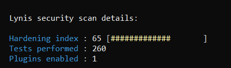
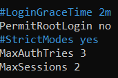
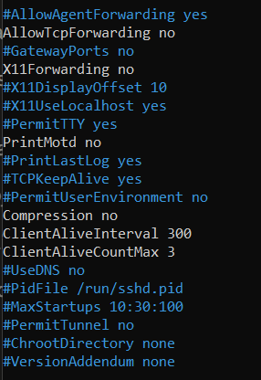
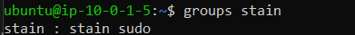
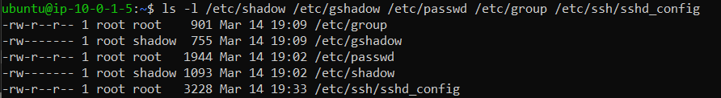

# AWS EC2 — Web Server Deployment & Server Hardening

Two projects on the same EC2 instance: deploying and configuring an Apache web server, then hardening the server following CIS benchmark guidelines using Lynis for audit scoring.

---

## Project 2 — SSH into EC2 and Install a Web Server

### What Was Done

- SSHed into a public EC2 instance (bastion host from the multi-tier VPC project)
- Installed and configured Apache web server
- Replaced the default Apache page with a custom HTML page
- Hardened Apache configuration to hide server version info
- Disabled directory listing
- Configured security group to allow HTTP (port 80) from anywhere, SSH (port 22) from my IP only

### Step-by-Step Commands

**SSH into the EC2 instance**
```bash
ssh -i /path/to/your-key.pem ubuntu@<your-ec2-public-ip>
```

**Install Apache**
```bash
sudo apt update
sudo apt install apache2 -y
```

**Start and enable Apache**
```bash
sudo systemctl start apache2
sudo systemctl enable apache2
sudo systemctl status apache2
```

**Replace the default page**
```bash
sudo nano /var/www/html/index.html
```

**Hide Apache server version**
```bash
sudo nano /etc/apache2/apache2.conf
```
Add at the bottom:
```
ServerTokens Prod
ServerSignature Off
```

**Disable directory listing**

Find this block in `/etc/apache2/apache2.conf`:
```
Options Indexes FollowSymLinks
```
Change to:
```
Options -Indexes FollowSymLinks
```

**Restart Apache to apply changes**
```bash
sudo systemctl restart apache2
```

**Verify server version is hidden**
```bash
curl -I http://<your-ec2-public-ip>
```
Should return `Server: Apache` with no version number.

**Monitor live access logs**
```bash
sudo tail -f /var/log/apache2/access.log
```

### Key Apache Commands
```bash
sudo systemctl status apache2    # check if running
sudo systemctl stop apache2      # stop the server
sudo systemctl start apache2     # start the server
sudo systemctl restart apache2   # restart after config changes
sudo systemctl enable apache2    # auto-start on reboot
```

---

## Project 3 — Harden an EC2 Instance (CIS Benchmarks)

### What Was Done

- Created a non-root sudo user
- Hardened SSH configuration (root login, idle timeout, auth limits)
- Set correct file permissions on critical system files
- Configured automatic security updates
- Ran Lynis CIS audit — scored **65/100** after hardening

### Lynis Score

| Run | Score | Tests Performed |
|---|---|---|
| After hardening | 65 / 100 | 260 |

---

### Step-by-Step Commands

#### 1. Create a Non-Root Sudo User

```bash
# Switch to default admin user first
sudo su -

# Create the new user
sudo adduser stain

# Set a password
sudo passwd stain

# Add to sudo group (Ubuntu uses 'sudo', not 'wheel')
sudo usermod -aG sudo stain

# Verify
groups stain
# Expected output: stain : stain sudo
```

#### 2. Harden SSH Configuration

```bash
sudo nano /etc/ssh/sshd_config
```

Changes made:
```
PermitRootLogin no              # block direct root login
LoginGraceTime 30               # 30 seconds to authenticate
MaxAuthTries 3                  # max 3 attempts before disconnect
MaxSessions 2                   # limit concurrent sessions
ClientAliveInterval 300         # disconnect idle sessions after 5 min
ClientAliveCountMax 3           # 3 keepalive checks before drop
X11Forwarding no                # disable GUI forwarding
AllowTcpForwarding no           # disable TCP tunneling
Compression no                  # disable compression
LogLevel VERBOSE                # detailed SSH logging
```

Restart SSH to apply:
```bash
sudo systemctl restart sshd
```

> **Important:** Always keep your current SSH session open and test login in a second terminal before closing. A misconfiguration can lock you out.

#### 3. Set File Permissions on Critical System Files

```bash
sudo chmod 600 /etc/shadow           # password hashes — root only
sudo chmod 600 /etc/gshadow          # group password hashes — root only
sudo chmod 644 /etc/passwd           # user accounts — readable, not writable
sudo chmod 644 /etc/group            # group info
sudo chmod 600 /etc/ssh/sshd_config  # SSH config — root only
```

Verify:
```bash
ls -l /etc/shadow /etc/gshadow /etc/passwd /etc/group /etc/ssh/sshd_config
```

Expected output:
```
-rw-r--r-- 1 root root   /etc/group
-rw-r----- 1 root shadow /etc/gshadow
-rw-r--r-- 1 root root   /etc/passwd
-rw------- 1 root shadow /etc/shadow
-rw-r--r-- 1 root root   /etc/ssh/sshd_config
```

#### 4. Configure Automatic Security Updates

```bash
sudo apt install unattended-upgrades -y
sudo dpkg-reconfigure --priority=low unattended-upgrades
# Select Yes when prompted

# Verify it is running
sudo systemctl status unattended-upgrades
```

#### 5. Run Lynis CIS Audit

```bash
sudo apt install lynis -y
sudo lynis audit system
```

View only warnings and suggestions:
```bash
sudo grep -E "WARNING|SUGGESTION" /var/log/lynis.log
```

Save the report:
```bash
sudo cp /var/log/lynis.log /home/ubuntu/lynis-log.txt
```

---

### Lynis Findings Summary

**Warning (1)**
- Vulnerable packages found — fixed with `sudo apt update && sudo apt upgrade -y`

**Key SSH suggestions addressed**
- `MaxAuthTries` reduced from 6 to 3
- `MaxSessions` reduced from 10 to 2
- `X11Forwarding` disabled
- `AllowTcpForwarding` disabled
- `Compression` disabled
- `LogLevel` changed from INFO to VERBOSE
- `ClientAliveInterval` set to 300

**Remaining suggestions (not actioned — noted for production)**
- Install fail2ban for brute force protection
- Install mod_evasive and ModSecurity for Apache WAF
- Enable auditd for system call auditing
- Separate /tmp, /var, /home into dedicated partitions
- Install a malware scanner (rkhunter or chkrootkit)

---

## Screenshots

| Description | Screenshot |
|---|---|
| Lynis hardening score (65/100) |  |
| SSH config — PermitRootLogin, MaxAuthTries, MaxSessions |  |
| SSH config — forwarding, compression, idle timeout |  |
| File permissions on critical system files |  |
| Non-root sudo user verification |  |

---

## Infrastructure

- **Instance type:** t2.micro
- **OS:** Ubuntu 22.04 LTS
- **Region / AZ:** eu-north-1a
- **Subnet:** public-subnet (10.0.1.0/24) — from multi-tier VPC project
- **Security group:** bastion-sg — port 22 from my IP only, port 80 open to world

## Services Used

`AWS EC2` · `Ubuntu 22.04` · `Apache2` · `OpenSSH` · `Lynis 3.0.7` · `unattended-upgrades`
